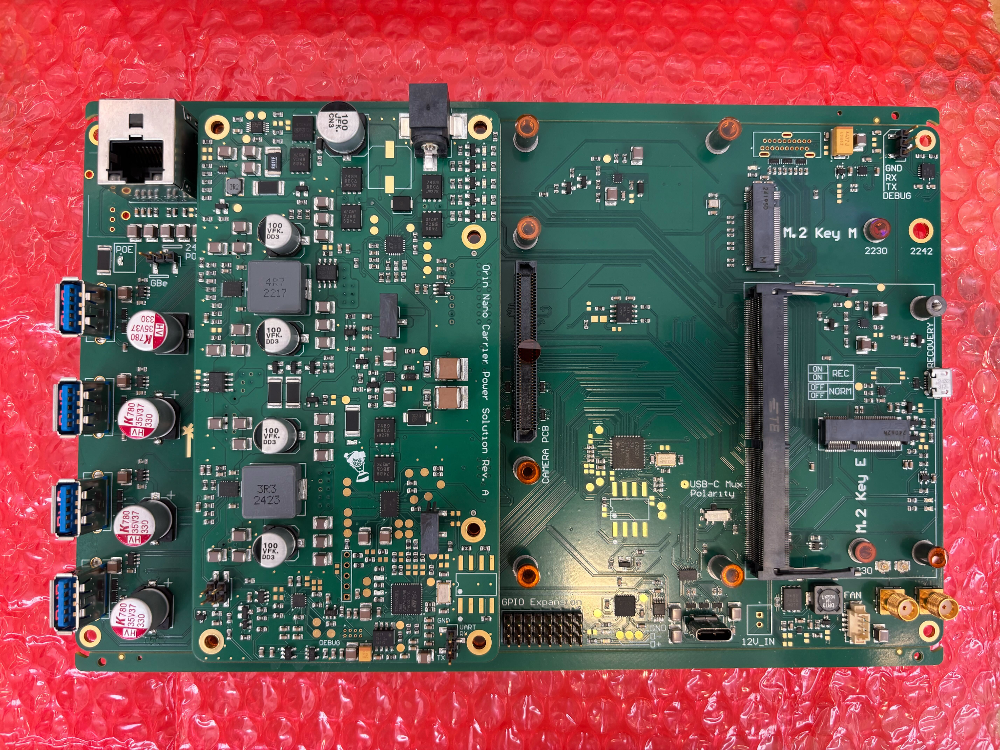

# novacarrier-assets
Resources for the [Monash Nova Rover](https://www.novarover.space/) NVIDIA Jetson Orin Nano Carrier Board.



## Directory Structure
```
├── build # This is where the Jetson Kernel is built (this is .gitignored) 
├── docs # Documentation and instructions (e.g., FLASH_INSTRUCTIONS.md)
├── flash # Scripts and configs used to flash the Jetson device
├── hardware # Hardware-related assets (e.g., firmware & firmware tools)
├── media # Pretty pictures
├── .gitignore # Ignored files (e.g., logs)
├── README.md # Project overview and directory layout
```

For instructions on flashing the Jetson device, see [`docs/FLASH_INSTRUCTIONS.md`](docs/FLASH_INSTRUCTIONS.md).
