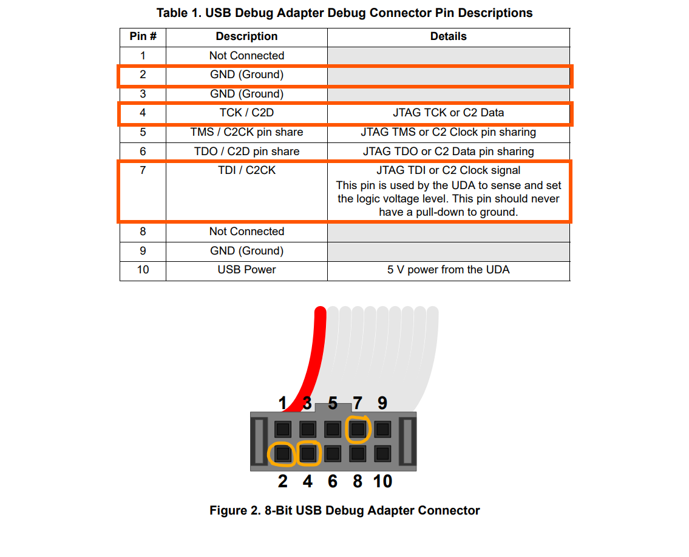
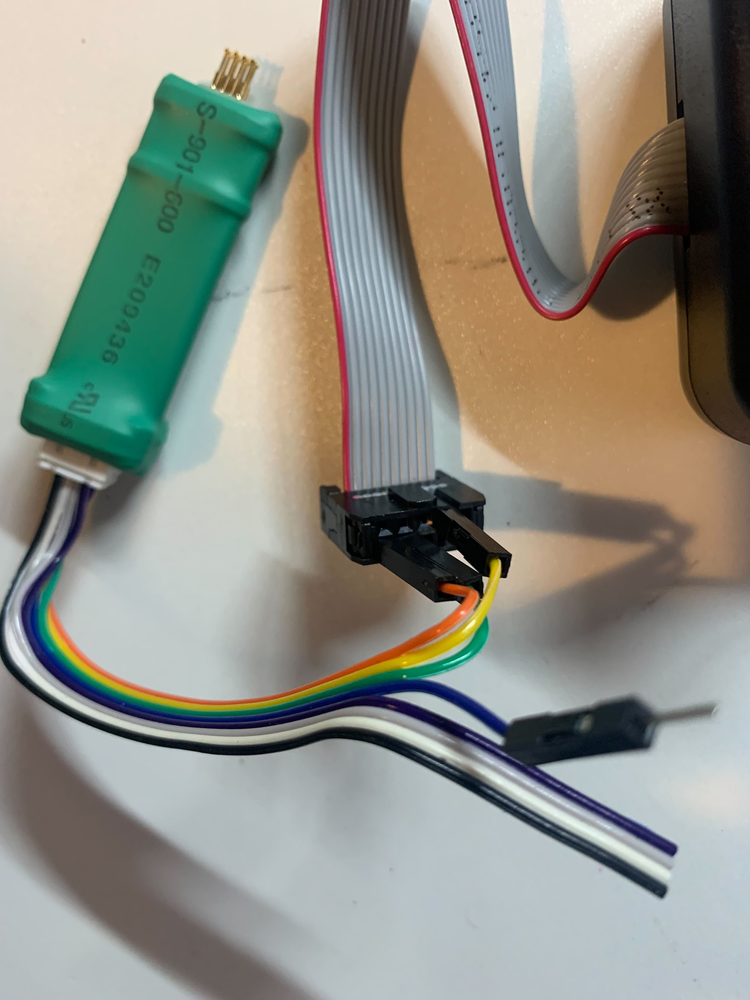
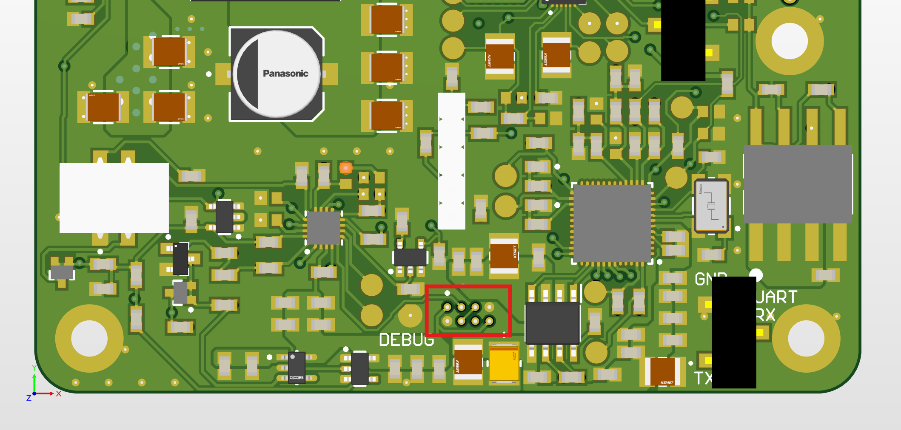
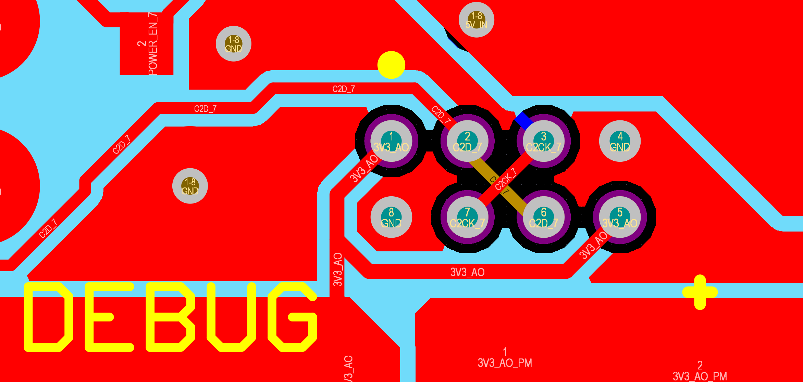

# Programming EFM8SB10F2G
Guide to programming the power MCU (EFM8SB10F2G) for the Orin Nano Carrier board. 

## Requirements
- Silicon Labs USB Debug Adapter
- Windows Machine
- FlashUtilCL.exe program

## Hardware Connection
To program the EFM8SB10F2G, you will need to connect 3 wires (C2D,  C2CK and GND) and power (usually through the barrel jack connector). Connect the C2D, C2CK and GND nets on the PCB to the corresponding wires from the USB Debug Adapter.
Images below for reference. 

    
    

    
  

## Method
1. Install FlashUtil.exe ([using utildll.exe installer](https://www.silabs.com/documents/login/software/utildll.exe) or in hardware/EFM8SB10F2G)
2. Run the following command from the C:\SiLabs\MCU\Utilities\FLASH Programming\Static Programmers\Command-Line directory, 
`.\FlashUtilCL.exe DownloadUSB <file.hex> <Serial Number String> <Disconnect Power On> <Debug Interface>`
- file.hex is the binary file to be flashed to the MCU (make sure this file is in the same directory as FlashUtilCL.exe)
- Serial Number String is the seral number of the USB Debug Adapater (this can be obtained using Simplicity Studio software)
- Disconnect Power On should be left as 0
- Debug interface is the programming interface (we are using the C2 interface which corresponds to '1', JTAG corresponds to '0')
For the default NVIDIA firmware file EFM8SB10F2G.hex with USB Debug Adapter serial number EC3005A2EC0 run the command 
`.\FlashUtilCL.exe DownloadUSB EFM8SB10F2G.hex EC3005A2EC0 0 1`
3. Verify the flashing process by connecting a USB-UART adapter to the UART interface of the MCU and confirm the FW verison is printed on startup (standard UART, 115200 baud)

## References
[https://community.silabs.com/s/article/how-to-use-flash-utility-command-line-tool-for-multi-device-jtag-chain-programmi](https://community.silabs.com/s/article/how-to-use-flash-utility-command-line-tool-for-multi-device-jtag-chain-programmi)
https://community.silabs.com/s/question/0D51M00007xePkRSAU/flashefm8?language=en_US 
https://www.silabs.com/documents/public/application-notes/AN136-production-programming-options.pdf
https://www.silabs.com/documents/public/application-notes/an117.pdf  
https://www.silabs.com/documents/public/user-guides/8-bit-USB-Debug-Adapter.pdf

