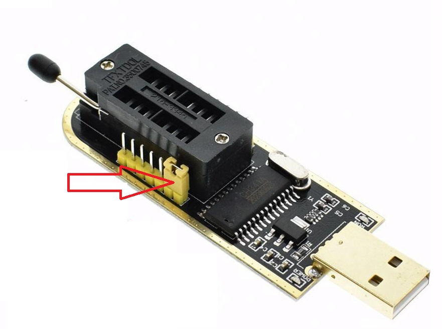

# uPD720201 EEPROM Dump Notes:
/upd72020x/upd720201_eeprom_dump/ch341a_spi dump files directory contains the binary firmware for the uPD720201 USB 3.0 chipset extracted from a commercial off-the-shelf mini-PCIe card. The firmware has been extracted using the CH341A mini programmer. 

**Note ensure the 3.3V data line modification has been made to the CH341A mini programmer and the yellow 2.54mm jumper is populated on pins 1 and 2! Refer to [this video](https://www.youtube.com/watch?v=HwnzzF645hA&t=330s) and [this website](https://www.onetransistor.eu/2017/08/ch341a-mini-programmer-schematic.html)**

### CH341A Mini Programmer with Populated Jumper

The software required to read the COTS mini-PCIe card EEPROM (Bright Moon Semiconductor T25S40) is [flashrom](https://github.com/flashrom/flashrom). Unfortunately, at time of writing the T25S40 is not supported by flashrom 1.2-4, however a small modification to the source files can be made to make it compatible with the T25S40. [See this pull request](https://github.com/flashrom/flashrom/pull/200).

